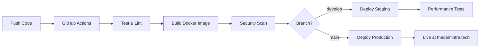

<div align="center">

<!-- Animated Header -->


<!-- Typing SVG -->
<a href="https://git.io/typing-svg"></a>

<!-- Animated Line -->


<!-- Profile Views & Social Badges -->
<p>
<a href="https://thademinfra.tech"></a>
<a href="https://www.linkedin.com/in/thadem-n-790bb520a"></a>
<a href="mailto:nithin.thadem@gmail.com"></a>

</p>

<!-- Tech Stack Badges with Animation -->
<p>


</p>

</div>

<!-- Snake Animation -->
<div align="center">
<picture>
  <source media="(prefers-color-scheme: dark)" srcset="https://raw.githubusercontent.com/platane/snk/output/github-contribution-grid-snake-dark.svg">
  <source media="(prefers-color-scheme: light)" srcset="https://raw.githubusercontent.com/platane/snk/output/github-contribution-grid-snake.svg">
  
</picture>
</div>

<!-- Animated Divider -->


##  About This Project


A **minimalist DevOps engineer portfolio**—built with CI/CD, containerized, and deployed via Infrastructure as Code.

> *"Automate everything, document always, and keep it reliable."*

### What Makes This Special?

- **Automated CI/CD pipeline** with GitHub Actions
- **Containerized architecture** using Docker
- **Infrastructure as Code** with Terraform
- **Kubernetes deployment** with production configs
- **Security scanning** and vulnerability detection
- **Monitoring and observability** ready

<br clear="right"/>

---

##  Tech Arsenal

<div align="center">

### Frontend & UI
<p>

</p>

### DevOps & Cloud
<p>

</p>

### Cloud Platforms
<p>

</p>

### Tools & Monitoring
<p>

</p>

</div>

---

##  Features

<table>
<tr>
<td width="50%">

### Design & UI
- Dark/Light Mode Toggle
- Responsive Mobile-First Design
- Animated Starfield Background
- Glassmorphism Effects
- Smooth Animations

</td>
<td width="50%">

### DevOps Features
- GitHub Actions CI/CD
- Multi-stage Docker Builds
- Kubernetes Deployments
- Trivy Security Scanning
- Prometheus Metrics

</td>
</tr>
</table>

<details>
<summary><b>View All Features</b></summary>

### Performance
- Optimized Build with Code Splitting
- SEO Friendly Meta Tags
- WCAG Accessibility Compliant

### Sections
- Hero Section with DevOps Focus
- Interactive Skills Showcase
- Project Portfolio Gallery
- Infrastructure Status Dashboard
- Contact Form

### Interactive Elements
- Smooth Scroll Navigation
- Hover Micro-interactions
- Toast Notifications
- Mobile-responsive Menu

</details>

---

##  Project Structure

```
├── src/                           # React application source
│   ├── components/                # React components
│   │   ├── ui/                   # Reusable UI components
│   │   ├── HeroSection.jsx        # DevOps-focused hero
│   │   ├── SkillsSection.jsx      # DevOps skills showcase
│   │   ├── ProjectsSection.jsx    # DevOps projects showcase
│   │   └── ...
│   ├── hooks/                     # Custom React hooks
│   ├── lib/                       # Utility functions
│   └── pages/                     # Page components
├── k8s/                          # Kubernetes manifests
│   ├── staging/                   # Staging environment configs
│   └── production/                # Production environment configs
├── terraform/                     # Infrastructure as Code
│   ├── modules/                   # Reusable Terraform modules
│   ├── main.tf                    # Main infrastructure
│   └── variables.tf               # Input variables
├── .github/workflows/             # CI/CD pipelines
├── Dockerfile                     # Multi-stage container build
└── nginx.conf                     # Production web server config
```

---

##  Quick Start

<div align="center">

```bash
# Clone the repository
git clone https://github.com/Nithin-Thadem/infrafolio.git

# Navigate to directory
cd infrafolio

# Install dependencies
npm install

# Start development server
npm run dev
```


</div>

### Available Scripts

| Command | Description |
|---------|-------------|
| `npm run dev` | Start development server |
| `npm run build` | Build for production |
| `npm run preview` | Preview production build |
| `npm run lint` | Run ESLint |

---

##  Deployment

<div align="center">



</div>

### Infrastructure Deployment

```bash
# Initialize Terraform
cd terraform
terraform init
terraform plan -var-file="environments/production.tfvars"
terraform apply -var-file="environments/production.tfvars"

# Deploy to Kubernetes
kubectl apply -f k8s/production/
kubectl get pods -l app=portfolio
```

---

##  GitHub Stats

<div align="center">


</div>

---

##  Connect With Me

<div align="center">

<a href="https://thademinfra.tech">

</a>
<a href="https://www.linkedin.com/in/thadem-n-790bb520a">

</a>
<a href="mailto:nithin.thadem@gmail.com">

</a>

<br><br>

| | Contact Info |
|---|---|
| **Email** | nithin.thadem@gmail.com |
| **Phone** | (+39) 388 353 1895 |
| **Location** | Italy |

</div>

---

##  Support

<div align="center">

If you found this project helpful, consider giving it a star!

<a href="https://github.com/Nithin-Thadem/infrafolio/stargazers">

</a>

</div>

---

<div align="center">

<!-- Animated Footer -->


<p>


</p>

**Made with React, TailwindCSS & DevOps Magic**

*© 2024 Nithin Thadem. All rights reserved.*

</div>
